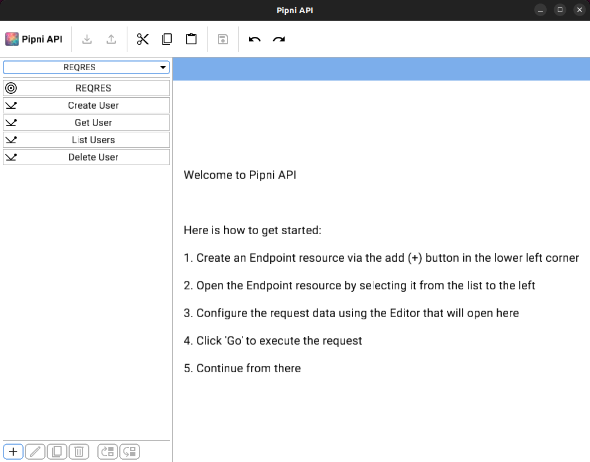

# Pipni API

Pipni API is a desktop application for testing HTTP RESTful endpoints.



**WARNING:** This project is still in its infancy and there is a lot to be fixed and added. You will find it hard to achieve your day-to-day goals with the current state.


## Getting Started

Stable versions of the project will be available in the Releases section of the repository.

Alternatively, if you have Go properly setup, you can fetch the project as follows:

```sh
git clone https://github.com/mokiat/PipniAPI
cd PipniAPI
```

And you can run it as follows.

```sh
go run ./cmd/PipniAPI
```

Though the preferred way is to use the Taskfile.

```sh
task run
```

## Goal and Purpose

My goal with this project was to satisfy my own personal need for a REST client desktop app that satisfies the following criteria:

- Lightweight - just making REST calls - no SOAP, no gRPC, GraphQL, etc...
- No cloud - a native app - no accounts, cloud setup, etc...
- Free - full power out of the box - no trial, subscriptions, etc...

My target is mostly an MVP that would allow me to do my day-to-day work activities. As such, I can't promise I will invest too much time in it, if it already covers my needs.


## Contributions

The best way to contribute is to open an Issue in GitHub.

The project is still in its infancy and uses an experimental UI framework from the [lacking](https://github.com/mokiat/lacking) game framework, it has a lot of moving parts. If you really want to contribute something, get in touch first - GitHub Issues, Discussions are your best bet.


## Why in Go and why a custom UI framework?

I tried a number of alternative approaches:

- Using ElectronJS and JavaScript.
- Using the Fyne Go framework.

I end up using my own UI framework for the following reason:

- It was a good way to improve my own framework by seeing what is missing.
- The declarative approach of the UI framework makes it easy to construct UIs.
- I like coding in Go - the language is powerful yet fun, tooling is standardized, dependencies are easy, running is fast.
